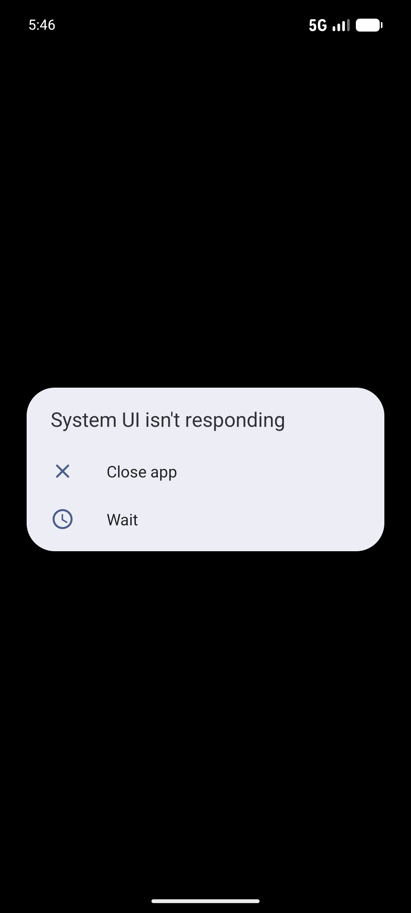

# 🔐 LifeLocker


> **One Secure Place for Your Entire Digital Life**

LifeLocker is a fully offline, security-first Android personal vault application built with Kotlin and Material Design 3. It allows you to securely store passwords, documents, identity records, secure notes, reminders, and emergency information — all encrypted locally on your device with no cloud dependency.

---

## ✨ Features

### 🔐 Secure Vault
- Store passwords, banking credentials, and identity records
- Passwords default to masked (`••••••••••`) — never plaintext
- Per-item authentication required to reveal any secret
- 10-second auto-remasking after reveal
- Instant mask on app background or lock

### 📄 Document Manager
- Import PDF, JPG, PNG, DOCX, ZIP, MP4 via Android SAF
- SHA-256 file integrity verification on import/export
- Category tagging: Passport, Driving Licence, Aadhaar, Insurance, Medical, Property, Vehicle, Other
- Expiry tracking with dashboard alerts
- Protected documents require authentication to open, share, or export

### 🔒 Secure Notes
- AES-256-GCM encrypted note contents
- List previews show `🔒 Encrypted content` — never plaintext
- Search operates on title and tags only

### ⏰ Smart Reminders
- WorkManager-based scheduled notifications
- No sensitive content exposed in notification payloads
- Per-reminder enable/disable

### 🚨 Emergency Profile
- ICE (In Case of Emergency) contact management
- Medical information storage
- One-tap emergency call via system dialler
- Accessible without full vault unlock

### 🛡️ Security Architecture
| Level | Mechanism | Scope |
|---|---|---|
| Level 1 | Master PIN / BiometricPrompt | App unlock |
| Level 2 | Item Password / Biometric / Master Code fallback | Per-item secret access |

- Android Keystore AES-256-GCM encryption
- `EncryptedSharedPreferences` for credentials
- `FLAG_SECURE` — prevents screenshots and recent-app preview leaks
- Session timeout with auto-lock
- Clipboard auto-clears after 30 seconds

### 🌙 Light & Dark Mode
- Full Material Design 3 theming
- System default / Light / Dark user-selectable

### 💾 Backup & Restore
- AES-256 encrypted `.enc` backup file via Android SAF
- No plaintext credentials in backup

---

## 🏗️ Tech Stack

| Category | Technology |
|---|---|
| Language | Kotlin |
| UI | XML + Material Design 3 |
| Architecture | MVVM + Repository Pattern |
| Async | Kotlin Coroutines + StateFlow |
| Database | Room (SQLite) |
| DI | Manual (ViewModelFactory) |
| Security | Android Keystore, BiometricPrompt, EncryptedSharedPreferences |
| Background | WorkManager |
| File Handling | Android SAF (Storage Access Framework) |
| Navigation | Jetpack Navigation Component |
| Image Loading | Coil |
| QR | ZXing (offline) |

---

## 🏛️ Architecture

```
UI (Fragments / Activities)
        │
        ▼
   ViewModel (StateFlow)
        │
        ▼
   Repository
        │
        ▼
     DAO (Room)
        │
        ▼
 Room Database (SQLite)
```

All database operations are performed asynchronously via Kotlin Coroutines. Fragments observe ViewModels via `collectLatest` on `StateFlow`. No database access occurs on the main thread.

---

## 📁 Project Structure

```
app/src/main/java/com/lifelocker/
├── LifeLockerApp.kt              # Application class
├── MainActivity.kt               # Single-activity host
│
├── data/                         # Data layer
│   ├── LifeLockerDatabase.kt     # Room database (v4)
│   ├── VaultItem.kt / VaultDao.kt / VaultRepository.kt
│   ├── Document.kt / DocumentDao.kt / DocumentRepository.kt
│   ├── ReminderItem.kt / ReminderDao.kt / ReminderRepository.kt
│   ├── SecureNote.kt / SecureNoteDao.kt / SecureNoteRepository.kt
│   ├── EmergencyContact.kt / EmergencyDao.kt / EmergencyRepository.kt
│   └── ActivityLog.kt / ActivityLogDao.kt
│
├── ui/                           # UI layer
│   ├── SplashFragment.kt
│   ├── LockFragment.kt
│   ├── DashboardFragment.kt
│   ├── VaultListFragment.kt / AddEditVaultFragment.kt
│   ├── DocumentListFragment.kt / DocumentDetailFragment.kt / AddEditDocumentFragment.kt
│   ├── SecureNotesFragment.kt / AddEditNoteFragment.kt
│   ├── ReminderListFragment.kt / AddEditReminderFragment.kt
│   ├── EmergencyFragment.kt / AddEditContactFragment.kt
│   ├── SettingsFragment.kt
│   ├── CameraScanFragment.kt
│   ├── adapters/                 # RecyclerView adapters
│   └── dialogs/                  # Bottom sheets & dialogs
│       └── ItemProtectionBottomSheetFragment.kt
│
├── viewmodel/                    # ViewModels + Factory
│   ├── AuthViewModel.kt
│   ├── VaultViewModel.kt
│   ├── DocumentViewModel.kt
│   ├── ReminderViewModel.kt
│   ├── SecureNoteViewModel.kt
│   ├── EmergencyViewModel.kt
│   └── ViewModelFactory.kt
│
├── utils/                        # Utilities & Security
│   ├── SecurityManager.kt        # PIN hashing, biometric prefs
│   ├── BiometricHelper.kt        # AndroidX BiometricPrompt wrapper
│   ├── SensitiveActionAuthenticator.kt
│   ├── SessionManager.kt         # Auto-lock timeout
│   ├── RevealStateManager.kt     # 10-second auto-remask
│   ├── SecureClipboardHelper.kt  # 30-second clipboard clear
│   ├── CryptoUtils.kt            # AES-256-GCM helpers
│   ├── BackupManager.kt          # Encrypted backup/restore
│   ├── FileStorageHelper.kt      # SAF file import/export + SHA-256
│   ├── ExpiryHelper.kt           # Document expiry logic
│   ├── NotificationHelper.kt     # Notification channel setup
│   ├── QrCodeHelper.kt           # ZXing QR generation
│   └── PermissionUtil.kt
│
└── workers/
    └── ReminderWorker.kt         # WorkManager reminder notifications
```

---

## 📸 Screenshots

| Lock Screen | Dashboard |
|---|---|
|  |  |

---

## 📦 Installation

### From APK
1. Download the latest `app-release.apk` from [Releases](https://github.com/sanjeevsura/lifelocker/releases)
2. Enable "Install from unknown sources" on your device
3. Install the APK

### From Source
```bash
git clone https://github.com/sanjeevsura/lifelocker.git
cd lifelocker
./gradlew assembleDebug
```
APK will be at: `app/build/outputs/apk/debug/app-debug.apk`

---

## 🔨 Build

```bash
# Debug build
./gradlew assembleDebug

# Release build (requires signing config)
./gradlew assembleRelease

# Run unit tests
./gradlew test

# Lint check
./gradlew lintDebug
```

**Requirements:**
- Android Studio Hedgehog or later
- JDK 17
- Android SDK API 26+

---

## 🔒 Security Notes

- All sensitive data encrypted with **AES-256-GCM** via Android Keystore
- No network requests — fully offline
- `FLAG_SECURE` prevents screenshots and recent-app preview leaks
- Clipboard auto-purges after 30 seconds
- Passwords auto-mask after 10 seconds of reveal
- Backup files are AES-256 encrypted `.enc` format — never plaintext

---

## 🚀 Future Enhancements

- [ ] Biometric-only item unlock (without Master Code fallback option)
- [ ] Per-item password with PBKDF2 key derivation
- [ ] Google Drive / local backup scheduling
- [ ] Password health & strength analyzer
- [ ] Password expiry reminders
- [ ] Tablet/large-screen adaptive layouts

---

## 📄 License

This project is for personal and educational use. All rights reserved © 2024 Sanjeev Sura.
